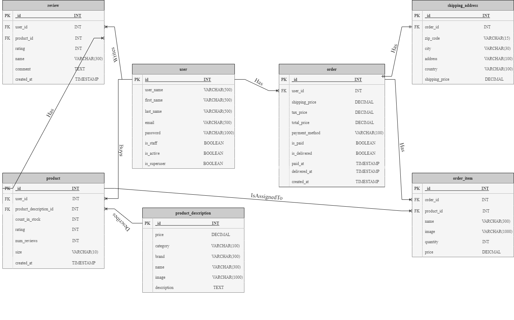
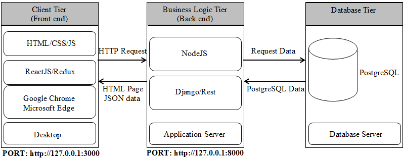

***NOTE: When visiting this application make sure that you are using the protocol <ins>https</ins> and NOT http otherwise the application will not work!***
# [SneakerLab](https://sneakerlab.shop/#/) | Sneaker Slides Ecommerce Platform

[![Contributors][contributors-shield]][contributors-url]
[![Forks][forks-shield]][forks-url]
[![Stargazers][stars-shield]][stars-url]
[![Issues][issues-shield]][issues-url]
[![MIT License][license-shield]][license-url]
[![LinkedIn][linkedin-shield]][linkedin-url]
[![GitHub][github-shield]][github-url]

# [SneakerLab](https://sneakerlab.shop/#/) | Sneakers Slides Ecommerce Platform

 

  

<h3 align="center">SneakerLab</h3>

  

    <b>SneakerLab</b> allows people to buy the latest, rarest, and limited sneakers and slides of specific sizes. <b>SneakerLab</b> is interesting because it only targets people who have a high interest and passion in buying limited collection shoes and slides. Moreover, there are not many web applications that are focusing exclusively on selling limited collection products.
     
    <a href="https://github.com/GeorgiosIoannouCoder/sneakerlab"><strong>Explore the docs »</strong></a>
     
     
    <a href="https://sneakerlab.shop/#/">View Web Application</a>
    ·
    <a href="https://github.com/GeorgiosIoannouCoder/sneakerlab/issues">Report Bug</a>
    ·
    <a href="https://github.com/GeorgiosIoannouCoder/sneakerlab/issues">Request Feature</a>
  

  
Table of Contents

  <ol>
    <li>
      <a href="#about-the-project">About The Project</a>
      <ul>
        <li><a href="#key-features">Key Features</a></li>
        <li><a href="#built-with">Built With</a></li>
         <li><a href="#database-er-diagram">Database ER-Diagram</a></li>
        <li><a href="#architecture">Architecture</a></li>
      </ul>
    </li>
    <li><a href="#usage">Usage</a></li>
    <li><a href="#contributing">Contributing</a></li>
    <li><a href="#license">License</a></li>
    <li><a href="#contact">Contact</a></li>
  </ol>

## About The Project

#### <ins>***SneakerLab tries to solve the following problem statement in the ecommerce industry:***</ins>

- **People need a platform to easily locate and buy limited sneakers and slides, without heavy advertisements!**

### Key Features

1. **Sign-up page with a real-time validation and feedback form.**
2. **Fully customizable profile.**
3. **User-friendly checkout proces.**
4. **Order tracking.**
5. **View, manage, edit orders.**
6. **Allow users to review products via the fully functional review system.**
7. **PayPal and credit/debit card payment integration.**
8. **Admin panel that allows admin users to see all listed products, create products, edit products, delete products, create users, edit users, delete users, edit orders, and upload photos.**

<a href="#readme-top">Back to top</a>

### Built With

[![Figma][Figma]][Figma-url]
[![Postman][Postman]][Postman-url]
[![Django][Django]][Django-url]
[![PostgreSQL][PostgreSQL]][PostgreSQL-url]
[![Node][Node.js]][Node-url]
[![Express][Express.js]][Express-url]
[![Redux][Redux]][Redux-url]
[![JWT][JWT]][JWT-url]
[![JavaScript][Javascript]][Javascript-url]
[![HTML][HTML]][HTML-url]
[![CSS][CSS]][CSS-url]
[![React][React]][React-url]
[![Bootstrap][Bootstrap]][Bootstrap-url]
[![Paypal][PayPal]][PayPal-url]
[![AWS][AWS]][AWS-url]
[![Git][Git]][Git-url]
[![Heroku][Heroku]][Heroku-url]

<a href="#readme-top">Back to top</a>

### Database ER-Diagram

  

<a href="#readme-top">Back to top</a>

### Architecture

  

<a href="#readme-top">Back to top</a>

## Usage

To try the SneakerLab application click on this [link](https://sneakerlab.shop/#/)!

You can use the following three accounts to test the application in case that you do not want to register:

1. Admin
    - Email: admin@email.com
    - Password: admin123

2. User
    - Email: stevejobs@apple.com
    - Password: steve123

3. User
    - Email: billgates@microsoft.com
    - Password: bill123

<a href="#readme-top">Back to top</a>

## Contributing

Contributions are what make the open source community such an amazing place to learn, inspire, and create. Any contributions you make are **greatly appreciated**.

If you have a suggestion that would make this better, please fork the repo and create a pull request. You can also simply open an issue with the tag "enhancement".
Don't forget to give the project a star! Thanks again!

1. Fork the Project
2. Create your Feature Branch (`git checkout -b feature/AmazingFeature`)
3. Commit your Changes (`git commit -m 'Add some AmazingFeature'`)
4. Push to the Branch (`git push origin feature/AmazingFeature`)
5. Open a Pull Request

<a href="#readme-top">Back to top</a>

## License

Distributed under the MIT License. See [LICENSE](https://github.com/GeorgiosIoannouCoder/sneakerlab/blob/master/LICENSE) for more information.

MIT License

Copyright (c) 2023 Georgios Ioannou

Permission is hereby granted, free of charge, to any person obtaining a copy
of this software and associated documentation files (the "Software"), to deal
in the Software without restriction, including without limitation the rights
to use, copy, modify, merge, publish, distribute, sublicense, and/or sell
copies of the Software, and to permit persons to whom the Software is
furnished to do so, subject to the following conditions:

The above copyright notice and this permission notice shall be included in all
copies or substantial portions of the Software.

THE SOFTWARE IS PROVIDED "AS IS", WITHOUT WARRANTY OF ANY KIND, EXPRESS OR
IMPLIED, INCLUDING BUT NOT LIMITED TO THE WARRANTIES OF MERCHANTABILITY,
FITNESS FOR A PARTICULAR PURPOSE AND NONINFRINGEMENT. IN NO EVENT SHALL THE
AUTHORS OR COPYRIGHT HOLDERS BE LIABLE FOR ANY CLAIM, DAMAGES OR OTHER
LIABILITY, WHETHER IN AN ACTION OF CONTRACT, TORT OR OTHERWISE, ARISING FROM,
OUT OF OR IN CONNECTION WITH THE SOFTWARE OR THE USE OR OTHER DEALINGS IN THE
SOFTWARE.

<a href="#readme-top">Back to top</a>

## Contact

Georgios Ioannou - [@LinkedIn](https://linkedin.com/in/georgiosioannoucoder)

Georgios Ioannou - [@georgiosioannoucoder](https://georgiosioannoucoder.github.io/) - Please contact me via the form in my portfolio.

Project Link: [https://github.com/GeorgiosIoannouCoder/sneakerlab](https://github.com/GeorgiosIoannouCoder/sneakerlab)

<a href="#readme-top">Back to top</a>

[contributors-shield]: https://img.shields.io/github/contributors/GeorgiosIoannouCoder/sneakerlab.svg?style=for-the-badge
[contributors-url]: https://github.com/GeorgiosIoannouCoder/sneakerlab/graphs/contributors

[forks-shield]: https://img.shields.io/github/forks/GeorgiosIoannouCoder/sneakerlab.svg?style=for-the-badge
[forks-url]: https://github.com/GeorgiosIoannouCoder/sneakerlab/network/members

[stars-shield]: https://img.shields.io/github/stars/GeorgiosIoannouCoder/sneakerlab.svg?style=for-the-badge
[stars-url]: https://github.com/GeorgiosIoannouCoder/sneakerlab/stargazers

[issues-shield]: https://img.shields.io/github/issues/GeorgiosIoannouCoder/sneakerlab.svg?style=for-the-badge
[issues-url]: https://github.com/GeorgiosIoannouCoder/sneakerlab/issues

[license-shield]: https://img.shields.io/github/license/GeorgiosIoannouCoder/sneakerlab.svg?style=for-the-badge
[license-url]: https://github.com/GeorgiosIoannouCoder/sneakerlab/blob/main/LICENSE

[linkedin-shield]: https://img.shields.io/badge/-LinkedIn-black.svg?style=for-the-badge&logo=linkedin&colorB=0077B5
[linkedin-url]: https://linkedin.com/in/georgiosioannoucoder

[github-shield]: https://img.shields.io/badge/-GitHub-black.svg?style=for-the-badge&logo=github&colorB=000
[github-url]: https://github.com/GeorgiosIoannouCoder/

[Figma]: https://img.shields.io/badge/figma-a259ff?style=for-the-badge&logo=figma&logoColor=1abcfe
[Figma-url]: https://www.figma.com/

[Postman]: https://img.shields.io/badge/postman-000000?style=for-the-badge&logo=postman&logoColor=orange
[Postman-url]: https://www.postman.com/

[Django]: https://img.shields.io/badge/django-000000?style=for-the-badge&logo=django&logoColor=092e20
[Django-url]: https://www.djangoproject.com/

[PostgreSQL]: https://img.shields.io/badge/postgresql-000000?style=for-the-badge&logo=postgresql&logoColor=008bb9
[PostgreSQL-url]: https://www.postgresql.org/

[Node.js]: https://img.shields.io/badge/node.js-303030?style=for-the-badge&logo=nodedotjs&logoColor=3c873a
[Node-url]: https://nodejs.org/en

[Express.js]: https://img.shields.io/badge/express.js-000000?style=for-the-badge&logo=express&logoColor=ffffff
[Express-url]: https://expressjs.com/

[Redux]: https://img.shields.io/badge/redux-000000?style=for-the-badge&logo=redux&logoColor=764abc
[Redux-url]: https://redux.js.org/

[JWT]: https://img.shields.io/badge/JWT-black?style=for-the-badge&logo=JSON%20web%20tokens
[JWT-url]: https://jwt.io/

[JavaScript]: https://img.shields.io/badge/javascript-323330?style=for-the-badge&logo=javascript&logoColor=f0db4f
[JavaScript-url]: https://www.javascript.com/

[HTML]: https://img.shields.io/badge/html-e34c26?style=for-the-badge&logo=html5&logoColor=ffffff
[HTML-url]: https://developer.mozilla.org/en-US/docs/Web/HTML

[CSS]: https://img.shields.io/badge/css-ffffff?style=for-the-badge&logo=css3&logoColor=264de4
[CSS-url]: https://developer.mozilla.org/en-US/docs/Web/CSS

[React]: https://img.shields.io/badge/React-20232A?style=for-the-badge&logo=react&logoColor=61DAFB
[React-url]: https://react.dev/

[Bootstrap]: https://img.shields.io/badge/bootstrap-ffffff?style=for-the-badge&logo=bootstrap&logoColor=563d7c
[Bootstrap-url]: https://getbootstrap.com/

[PayPal]: https://img.shields.io/badge/paypal-ffffff?style=for-the-badge&logo=paypal&logoColor=00457C
[PayPal-url]: https://developer.paypal.com/home

[AWS]: https://img.shields.io/badge/aws-000000?style=for-the-badge&logo=amazon&logoColor=ff9900
[AWS-url]: https://aws.amazon.com/

[Git]: https://img.shields.io/badge/git-000000?style=for-the-badge&logo=git&logoColor=orange
[Git-url]: https://git-scm.com/

[Heroku]: https://img.shields.io/badge/heroku-6762A6?style=for-the-badge&logo=heroku&logoColor=ffffff
[Heroku-url]: https://www.heroku.com/
